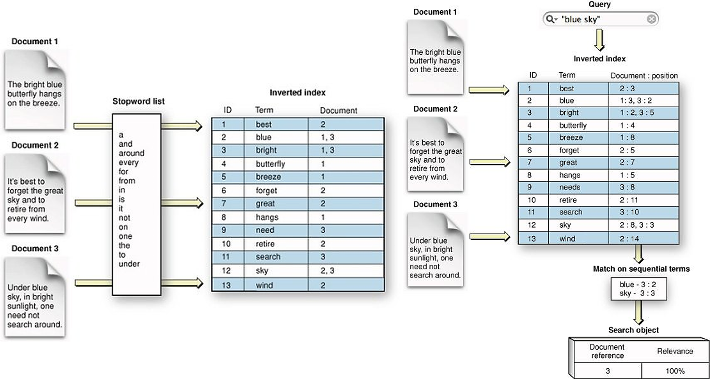

# Implementation Details

This section covers in detail the implementation details along with the reasons and some advantages of using the various modules. Also why the specific modules were chosen and built in that manner.

## Lucene Indexes
Now looking into the details there are many elments that work independently to make this application possible. The [data](https://www.semanticscholar.org/cord19/download) which is provided by Semantic Scholar and Allen Institute of AI is actually a compressed file containing multiple json files in different folders. Each json file has the schema similar to that of a research paper which is something similar to this schema.
```
"root":
    {
        "paper_id":string"[paper id]"
        "metadata":{
            "title":string"[paper title]"
            "authors":[...]
            "abstract":string"[abstract]"
        }
        "body_text":
            [
                0:{
                    "text":string"[section text]"
                    "cite_spans":[...]
                    "section":string"[section name]"
                    "ref_spans":[]
                }
                1:{...}
                2:{...}
                3:{...}
                4:{...}
                ...
            ]
        "ref_entries":
            {
                "FIGREF0":{...}
            }
        "back_matter":[]
        "bib_entries":
            {
                "BIBREF0":
                    {
                        "title":string"[reference paper title]"
                        "authors":[...]
                        "year":int[year]
                        "venue":string"[text]"
                        "volume":string"[text]"
                        "issn":string""
                        "pages":string"[text]"
                        "other_ids":{...}
                    }
                "BIBREF1":{...}
                "BIBREF2":{...}
                "BIBREF3":{...}
                "BIBREF4":{...}
                ...
            }
    }
```
Since most of the actual data is present in the abstract and body_text we decided to index every document's data with the abstract and body_text for quicker access. In order to index the data we have used Apache Lucene (Apache Solr and Elasticsearch also uses Lucene indexes in the background). The figure below shows the basic internal structure of an index. The data in a segment is represented abstractly rather than as a realistic representation of the actual data structure. ___The code for creating lucene index is written in Java which is beyond the scope of this process.___


The below figure represents how indexes are created and retreived while searching is done.

Bystoring the documents in lucene indexes our search works at a complexity of O(1). In order to read more about Lucene indexes you can visit this [link](https://www.alibabacloud.com/blog/analysis-of-lucene---basic-concepts_594672?spm=a2c41.12761052.0.0).
___

## BERT model

Once the data we will be using pyserini to query and fetch data from the lucene indexes and use BERT for question answering that is trained on SQuAD dataset. This is required because we would some model that can understand the intent of the user's question and serve only the best matching results. For this BERT is one of the best pre-trained models that is available.  It is designed to work natively on pre-train deep bidirectional representations from unlabeled text by jointly conditioning on both left and right context. As a result, the pre-trained BERT model can be fine-tuned with just one additional output layer to create state-of-the-art models for a wide range of NLP tasks. Now the SQuAD dataset is a reading comprehension dataset, consisting of questions posed by crowdworkers on a set of Wikipedia articles, where the answer to every question is a segment of text, or span, from the corresponding reading passage, or the question might be unanswerable. Thus the BERT model which is finetuned on SQuAD data gives us with almost all the right tools to start building our application. The image below is a representation of how the model is working. 
 
The great thing with BERT is that it's embedding is very powerful hence it is very suitable for many NLP tasks. You can read more about how BERT is used for question answering on the SQuAD data in this [paper](https://web.stanford.edu/class/archive/cs/cs224n/cs224n.1194/posters/15848195.pdf). For our code we used the bert-large model finetuned on squad data as a pretrained model in PyTorch from the Hugging Face Transformers library.
___

## BART model

After this we used the BART algorithm. BART is a denoising autoencoder for pretraining sequence-to-sequence models. As described in the [paper](https://research.fb.com/wp-content/uploads/2020/06/BART-Denoising-Sequence-to-Sequence-Pre-training-for-Natural-Language-Generation-Translation-and-Comprehension.pdf), BART uses a standard seq2seq/machine translation architecture with a bidirectional encoder (like BERT) and a left-to-right decoder (like GPT). The pretraining task involves randomly shuffling the order of the original sentences and a novel in-filling scheme, where spans of text are replaced with a single mask token as described in it's architecture. 

As a result, BART performs well on multiple tasks like abstractive dialogue, question answering and summarization. BART is particularly effective when fine tuned for text generation but also works well for comprehension tasks. It matches the performance of RoBERTa with comparable training resources on GLUE and SQuAD, achieves new state-of-the-art results on a range of abstractive dialogue, question answering, and summarization tasks. Therefore we decided to use BART for generating the final rich-text as a short summary of all the answers.
We used the bart-large model which is trained on the CNN/Daily Mail data set and it has been the canonical data set for summarization work. The data sets consist of news articles and abstractive summaries written by humans. Even though the model that is trained on CNN/Daily Mail data should not be used for generating COVID-19 research articles summary the results obtained has mixed performance but it does provide a coherent summary which is factually correct hence we decided to stick with it(for now).
___

## BioBERT model

At this stage we had achieved our objective of building a search engine on top of research articles but we decided to push it further so that we can also get details from a specific paper for the given question. For this we could have simply utilized the existing BERT model to get out objective and it would have worked out fine. But even in BERT the ability of understanding the medical data was not present. We needed something that could give more context to understand biomedical data so that the results from the specific document really looks to have the detailed answer of the question.
For these reasons we decided to use the [BioBERT model](https://web.stanford.edu/class/archive/cs/cs224n/cs224n.1194/posters/15743952.pdf). This is a pre-trained bio-medical language representation model for various bio-medical text mining tasks. Tasks such as NER from Bio-medical data, relation extraction, question & answer in the biomedical field can be solved by utilizing this model. Since the model itself is a domain specific language representation model based on BERT and pre-trained on arge-scale biomedical corpora of PMC and PubMed.

We mainly used BioBERT for summarization and selecting text that had the most similar matches to the tokens in the question however that is not all. BioBERT can actually be utilized for biomedical NER (which is beyond the scope of this process), and relation extraction for build relations in graphs. Our use case in this case is served by using BioBERT for question answering.
___
