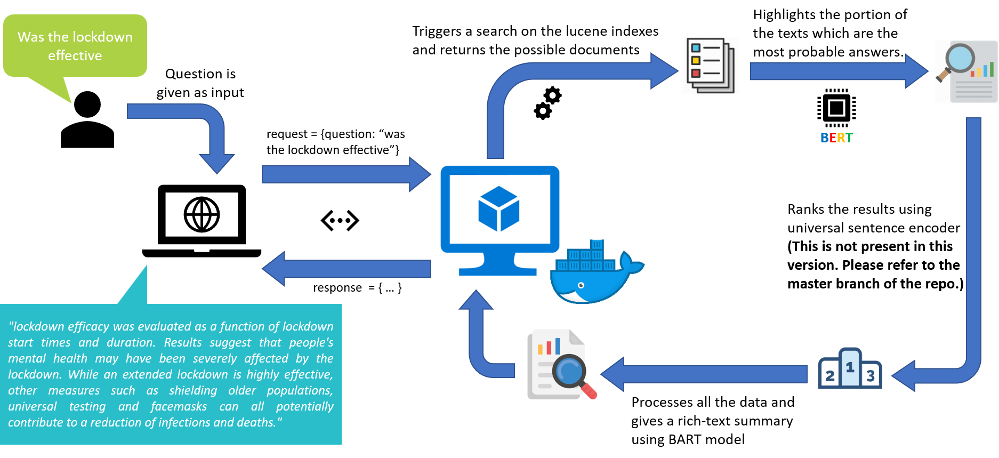

# Welcome to COVID-19 Q&A deployment

## Project layout

    covid_qna    
    ├─ data/                   # Stores the data and .py file for downloading the data.
    │  └─ data_download.py     # Code for downloading all the lucene-indexed data.
    │
    ├─ src/                    # Contains all the code necessary for execution of the application.
    │  └─ main.py              # Has the definition of every API that is calling the modules class.
    │  └─ init_models.py       # Used for downloading and initializing all the models.
    │  └─ modules.py           # Contains all the function definitions for the various modules.
    │
    ├─ results/                # Stores the results of each query.
    │  └─ rich_text.json       # Example API rersponse as json for rich-text query.
    │  └─ detailed_text.json   # Example API rersponse as json for detailed-text query.
    │
    └─ requirements.txt        # List of all python packages that are used.
    └─ Dockerfile              # Definition for building the docker image.
    └─ docker-compose.yaml     # YAML definition of docker-compose for easy deployment.
    └─ README.md

___

## Pipeline details

A simple workflow for the entire application can be summarized as follows:

___This application has utilized multiple modules each of which can be splitted and used seperately if required. If you would like to have a deeper understanding of how every module is working and the design choices at each and every step please click [here](implementation.md) or else you can use the navbar to navigate to the Implementation Details section.___

___

## Languages used
 (app running on FastAPI backend)


___This version has been modified slightly from the original version so that it can run without using GPU acceleration.___
* __If you would like to view the actual code with GPU acceleration that uses both Pytorch and Tensorflow please visit the master branch of the [bitbucket repo](https://bitbucket.org/bridgei2idev/covid_qna/src/master/). This code is similar to the no_gpu branch of the [repo](https://bitbucket.org/bridgei2idev/covid_qna/src/no_gpu/).__
* Please make sure to check the all files and comments and make necessary changes if required before building with docker.
* This is the python code for deployment purpose only. Once the indexes are built, the lucene index folder should be updated. *This code will NOT build the lucene indexes*.

___

## Prerequisites

* If you are planning to build and test (deploy) with docker then Docker CE or Docker EE needs to be installed. (Instuctions for installing docker are also covered in this documentation.)
* If you planning to not use docker then please use Linux environment to test. As of now this application will NOT run natively on windows OS.
* Python version 3.6 and above is supported.
* Corresponding pip version should also be present.

___

## Testing

The application was mainly designed as a quick response action item to the COVID-19 situation. Since there is a huge volume of unstructured data that needed to be mined this application was developed.

The testing is done mainly on the CORD-19 research dataset which has over 50,000 coronavirus and COVID-19 research articles apart from other articles as well. Total count of articles in the dataset as of date 17/09/2020 is 266175 (including duplicates).

You can visit this [site](http://13.92.197.252/) for check the application.
___

## Steps for building and executing
* __Before starting make sure you have a high speed internet connection and enough data because the code will download almost 10GB of data altogether while it is being built. Also make sure you have enough disk space because once the application/images are built the total size of both the application/images running in the system would be almost 20GB. (In case of docker the intermediate images are also built in this process that may be of even larger sizes, so make sure to clean the system at the end once the images are built.)__
* In case you are building with docker (recommended approach) please follow the below instructions else you can skip this section.

___

### Docker build guide
___Before going ahead with the docker build please remember that you will have to edit the module.py file once before the docker build instruction. Simply open the file and uncomment line 71 and comment out line 72 and save the file. That's all!___
##### For Windows systems
* If you are using windows chances are you might have to get in touch with the IT team to get Docker installed. This README is written considering you have admin rights or you are installing on a Windows server.
* Please visit this official [docker url](https://docs.docker.com/get-docker/) and then click on *'Docker Desktop for Windows'* followed by *'Download from Docker Hub'*. Finally click on *'Get Stable'* to download Docker Desktop Community Edition (However if you are installing on a windows server using Enterprise edition is recommended). After that simply install docker by follow the on screen instructions.
* Then unzip the archive and extract the files.
* Open terminal and change your path to the covid_qna directory. Once inside the directory you will need to download the lucene indexed data.
```
cd covid_qna/
```
* In order to download the lucene indexed data for covid-19 articles navigate to the *data* folder and execute the python script.
```
cd data/
pip install tqdm
python data_download.py
```
On running these commands the lucene index data in a .tar.gz file (4.5GB approx) will be downloaded.

* Navigate back to the root directory and run the following commands in sequence in order to build and run the docker images. *(Please check if you have edited the module.py file)*
```
cd ..
docker-compose build
docker-compose up -d
```
* The first command will build the docker images. It will take sometime (about 20-30mins depending on your internet speed and system processing speed.)*
* Once everything is done the application should start. In order to access the UI for the python APIs then please visit ```http://localhost:5000/docs/```.


##### For Linux systems
Open your terminal and type the following commanda to get docker and docker-compose installed.
```
<!-- For installing Docker -->
sudo apt install docker.io
docker --version

<!-- If you are unable to see the docker version then use the below command to add the current user to 
docker group after that logout and log back in and then re-run the above command to check the version. -->
sudo usermod -aG docker $USER

<!-- For installing docker-compose -->
sudo apt install docker-compose
docker-compose version
```
* Then unzip the archive and extract the files.
* Open terminal and change your path to the covid_qna directory. Once inside the directory you will need to download the lucene indexed data.
```
cd covid_qna/
```
* In order to download the lucene indexed data for covid-19 articles navigate to the *data* folder and execute the python script.
```
cd data/
pip install tqdm
python data_download.py
```
On running these commands the lucene index data in a .tar.gz file (4.5GB approx) will be downloaded.

* Navigate back to the root directory and run the following commands in sequence in order to build and run the docker images. *(Please check if you have edited the module.py file)*
```
cd ..
docker-compose build
docker-compose up -d
```
* The first command will build the docker images. It will take sometime (about 20-30mins depending on your internet speed and system processing speed.)*
* Once everything is done the application should start. In order to access the UI for the python APIs then please visit ```http://localhost:5000/docs/```.

##### Removing temporary images
Once the docker images are built you can choose to run the prune command to remove any intermediate/unused images that were created in the process of building the images. In order to do that please use the following command.
```
docker system prune
```
On running this command it will prompt to confirm by [y/N], press y to clean the intermediate/unused images
___

### Without using docker
___As of now the application does not work on windows because the Java virtual environment does not gets initialized. Hence the only approach is using Linux systems.___
##### For Linux systems
Open your terminal and type the following commanda to get the latest package updates and install Java, Python virtual environment and a few other necessary packages.
```
sudo apt-get update
sudo apt-get install -y openjdk-11-jdk
sudo apt-get install -y curl build-essential gcc python3 python3-venv
```
* Now create a new virtual environment and activate it. Then unzip the archive and extract the files.
```
python3 -m venv ml_env
source ml_env/bin/activate
unzip covid_qna.zip
```
* Now change your path to the covid_qna directory. Once inside the directory you will need to install the required python packages and then download the lucene indexed data.
```
cd covid_qna/
pip install -r requirements.txt
```
* In order to download the lucene indexed data for covid-19 articles navigate to the *data* folder and execute the python script.
```
cd data/
python data_download.py
```
On running these commands the lucene index data in a .tar.gz file (4.5GB approx) will be downloaded.
* Then you need to untar the compressed file for the python app.
```
tar -xvzf lucene-index-cord19.tar.gz
```
* Navigate back to the root directory and change to the src directory. After that run the commands to download all the models and run the application.
```
cd ../src/
python init_models.py
uvicorn --host 0.0.0.0 app:app
```
* The first command will download all the required models and prep them for the application.
* Once everything is done the application should start. In order to access the UI for the python APIs then please visit ```http://localhost:8000/docs/```.

___

## Bugs

* Application does not run natively on Windows OS.
* While using the rich-text/detailed-text API if there are no matches found then the response is given as an internal server error. It does not mean that the code has crashed. It is simply because it has not found anything to respond back. This bug will be fixed in the next version.

___

## Future scope

* The objective is to build a NLP engine so powerful that it can act by itself as a search engine over any kind of documented large scale data.
* Extend scope to include direct parsing of PDF or other documents and build indexes by itself.
* Add more flexibilty to support indexes from Elasticsearch and Apache Solr.
___

*I hope there would not be any problems while running the application. However, in case of any issues please reach out to [me](swastik.biswas@bridgei2i.com).*

